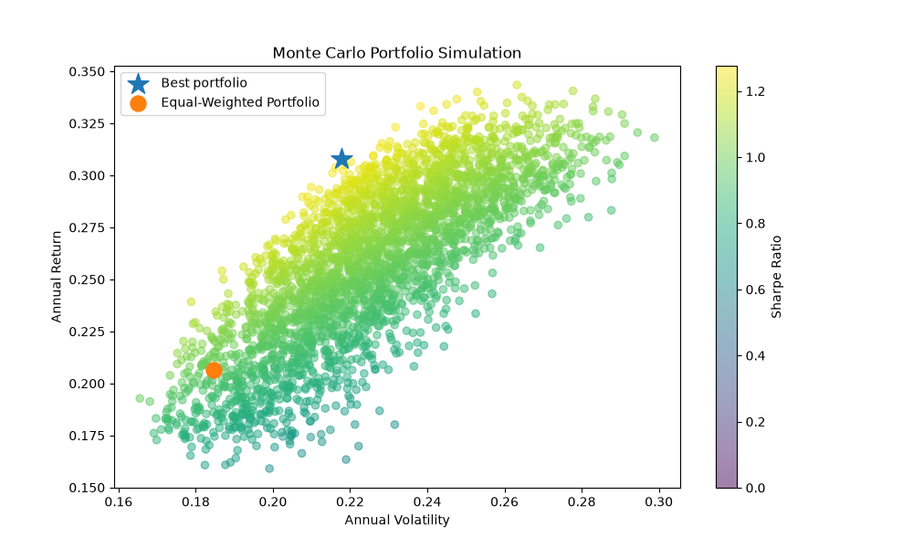

# Python Portfolio Analysis & Monte Carlo Optimisation

## Overview

This project uses Python to analyse historical financial data and investigate the relationship between investment return and risk.

The project analyses six equities and uses portfolio theory and Monte Carlo simulation to investigate how different portfolio allocations affect historical return, volatility and risk-adjusted performance.

## Objectives

- Analyse historical equity prices
- Calculate daily and annualised returns
- Measure historical volatility
- Analyse correlations between assets
- Calculate Sharpe ratios
- Construct an equal-weighted portfolio
- Simulate thousands of alternative portfolio allocations
- Apply a maximum 30% allocation constraint
- Compare an optimised simulated portfolio with an equal-weighted portfolio
- Visualise the portfolio risk-return relationship

## Assets Analysed

- Apple (AAPL)
- Microsoft (MSFT)
- Nvidia (NVDA)
- Amazon (AMZN)
- JPMorgan Chase (JPM)
- Coca-Cola (KO)

## Technologies

- Python
- NumPy
- pandas
- Matplotlib
- yfinance

## Methodology

Historical market data was obtained using `yfinance`.

Daily percentage returns were calculated from the historical price series. These were then used to calculate annualised return and volatility.

The project also calculates a correlation matrix to investigate how the assets move relative to one another.

Portfolio risk is calculated using the covariance matrix:

$$
\sigma_p = \sqrt{w^T\Sigma w}
$$

where:

- $w$ represents portfolio weights
- $\Sigma$ represents the covariance matrix
- $\sigma_p$ represents portfolio volatility

The Sharpe ratio is calculated as:

$$
Sharpe = \frac{R_p-R_f}{\sigma_p}
$$

A Monte Carlo simulation generates 5,000 random portfolio allocations. Portfolios where any individual holding exceeds 30% are rejected.

The simulated portfolios are then compared using their historical return, volatility and Sharpe ratio.

## Results

The project compares an equal-weighted portfolio with the highest-Sharpe portfolio identified through the Monte Carlo simulation.

Results vary between simulations because portfolio weights are randomly generated.

The results should therefore be interpreted as a demonstration of portfolio construction and risk analysis rather than as an investment recommendation or prediction of future performance.

## Limitations

- Historical performance does not guarantee future performance.
- The simulation uses a limited selection of six equities.
- The portfolio optimisation is based on historical data.
- Transaction costs and taxes are not modelled.
- The risk-free rate is based on an assumed value.
- The Monte Carlo simulation uses randomly generated portfolio weights.
- The model does not account for all real-world portfolio constraints.
## Monte Carlo Simulation

The simulation generates 5,000 possible portfolio allocations and evaluates each according to annual return, volatility and Sharpe ratio.

## Author

Physics undergraduate student at the University of Edinburgh.